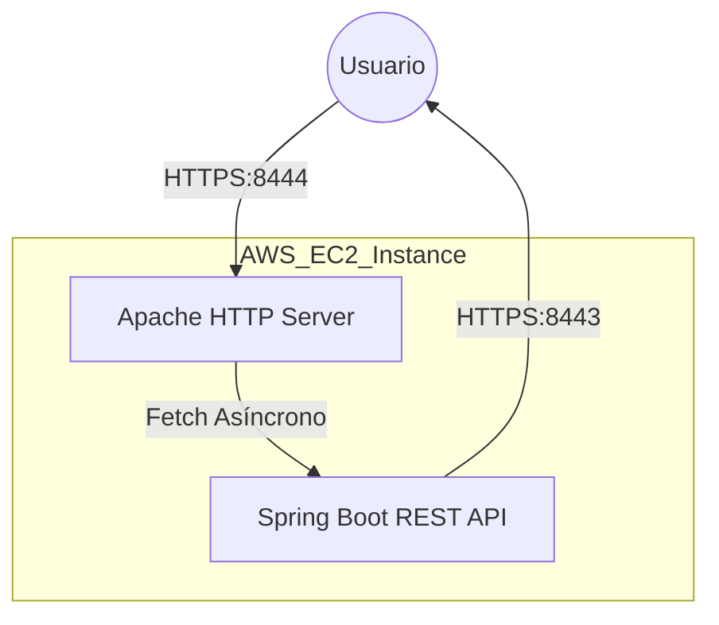

# Secure Application Design Workshop 🔐

Este repositorio contiene la implementación de un sistema web seguro y escalable, diseñado como parte del taller de Arquitectura Empresarial. El proyecto demuestra el uso de una arquitectura de dos servidores (Frontend y Backend) protegidos mediante **TLS (HTTPS)** y desplegados en contenedores **Docker** sobre infraestructura de **AWS**.

## 🚀 Características Principales

*   **Servidor Frontend (Apache)**: Entrega un cliente asíncrono (HTML5 + JS) a través de un canal cifrado.
*   **Servidor Backend (Spring Boot)**: Provee una API REST segura para la autenticidad y el manejo de datos.
*   **Seguridad Integral**:
    *   Cifrado de extremo a extremo con **TLS/SSL**.
    *   Certificados validados mediante **Let's Encrypt** (Certbot).
    *   Gestión de identidades con hashing de contraseñas (**BCrypt**).
*   **Infraestructura**: Despliegue automatizado con **Docker Compose** en instancias **Amazon EC2**.

---

## 🛠️ Tecnologías Utilizadas

| Componente | Tecnología |
| :--- | :--- |
| **Lenguaje Backend** | Java 17 (Spring Boot 3) |
| **Servidor Web** | Apache HTTP Server (httpd) |
| **Contenedores** | Docker & Docker Compose |
| **Seguridad** | OpenSSL, Certbot (Let's Encrypt) |
| **Dominio DNS** | DuckDNS |
| **Cloud** | AWS EC2 (Amazon Linux 2023) |

---

## 📐 Arquitectura del Sistema



---

## 📸 Evidencias de Despliegue

### 1. Configuración de Dominio (DuckDNS)
Se utilizó DuckDNS para asignar un nombre de dominio dinámico a la IP pública de AWS.


### 2. Infraestructura Docker
El sistema se despliega como un conjunto de microservicios orquestados, garantizando la portabilidad y el aislamiento.


### 3. Conexión Segura (Candado Verde)
Gracias a Let's Encrypt, el sitio cuenta con una conexión cifrada reconocida por todos los navegadores modernos.


---

## 📖 Instrucciones de Ejecución

### Requisitos Previos
*   Docker & Docker Compose.
*   Certificados SSL (para local se incluyen auto-firmados).

### Ejecución Local (Docker)
1.  Clonar el repositorio:
    ```bash
    git clone https://github.com/JuanPablo990/Secure-Application-Design.git
    cd Secure-Application-Design
    ```
2.  Levantar el stack:
    ```bash
    docker-compose up -d --build
    ```
3.  Acceder a `https://localhost:8444`.

---

## 📜 Autor
**Juan Pablo Nieto Cortes**
*Estudiante de Ingeniería de Sistemas*
*Escuela Colombiana de Ingeniería Julio Garavito*